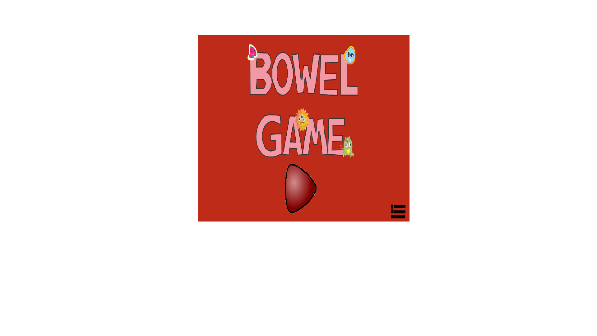

 

# Quem sou eu

Karla gabriella progamadora e estudande do curso de jogos digitaids no IFRN-CM.

## Games
   

  

  

## Artes
* Desenhos

## Projeto
### Aulas
#### Projeto Jogos
##### Projeto Musicas

# Contatos  

