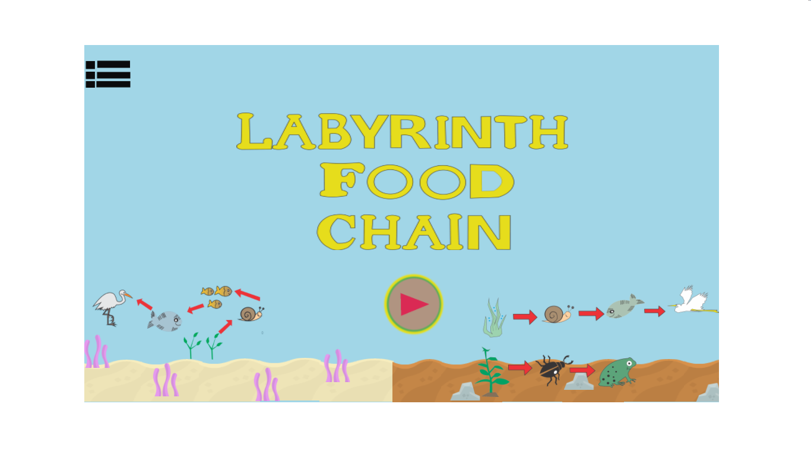
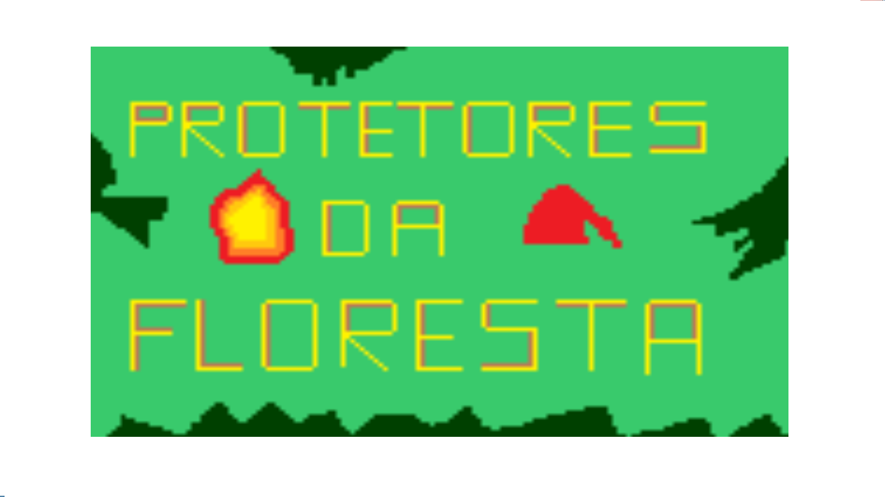
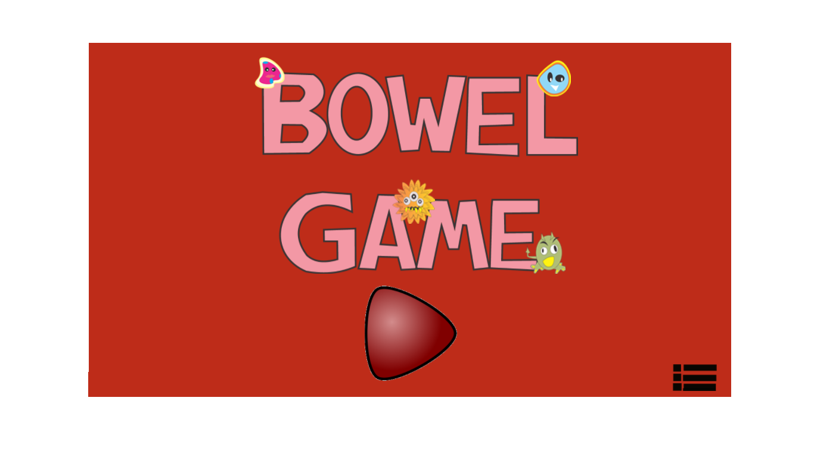
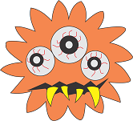
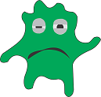
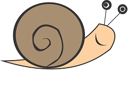
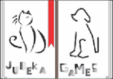

 

# Quem sou eu

Ola! eu me chamo Karla e esse e meu site, um lugar que você sempre vai encontrar meus projetos musicais,
projetos de jogos, desenhos etc. Eu estou no terceiro ano do curso de jogos digitais no IFRN-Ceara-Mirim. 
Espero que goste de minhas ideias (;

  

## Games
    

El Cuerpo e um jogo voltado para crianças onde através dele ensinamos um pouco de espanõl,
fazemos isso atraves do corpo humado. E um jogo onde você aprende enquanto você se diverte!
Clik na imagem para jogar e divirta-se! (:

   

Este e um jogo de labirindo onde você tem que ajudar o personagem a encontrar sua presa certa,
e um jogo educativo voltado para a área da biologia onde ocê apende um pouco sobre cadeias alimentares.
Clik na imagem para jogar e divirta-se! (:  

     

Jogo de plataforma onde com a sua ajuda o Saci ou O Curupira tem a missão de salvar a floresta
dos lenhadores que querem cortar as lindas e sentenarias árvores. Ajude-os e divirta-se!
Clik na imagem para jogar! (:

  

O Bowel Game e um jogo do tipo tower onde você tem que ajudar as bacterias boas do intestino
a se defender das bacterias ruins que vão tentar impedir o bom funcionamento da flora intestinal.
Clik na imagem para jogar e divirta-se! (:  

*****
## Artes
* Desenhos

        

*****

## Minhas Empresas   
   

*****

## Projetos  

### Projeto Jogos   

Aqui vai se encontrar futuramente meus projetos de jogos.

#### Projeto Musicais    

Aqui se encontrará musicas feitas no aplicativo Audacity para meus futuros jogos.
 

# Contatos  
         
